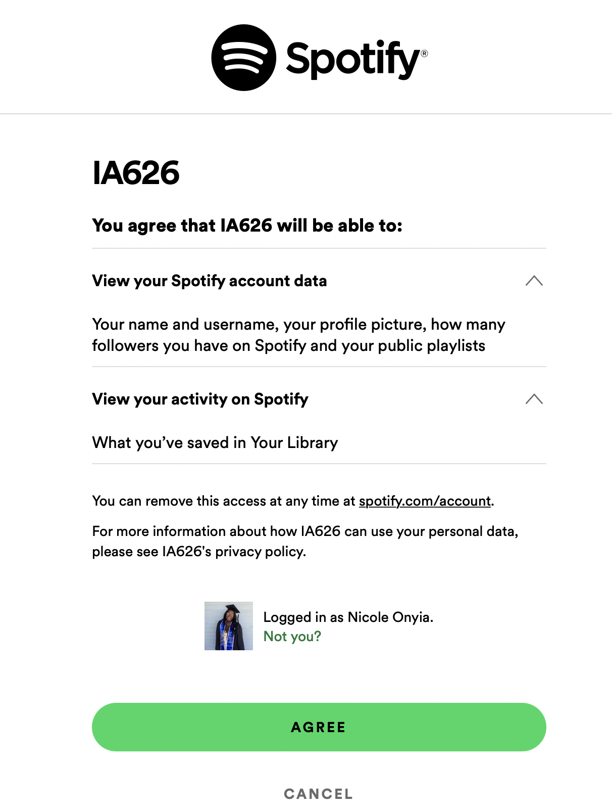

## Nicole's Life in Music: Analyzing 7 Years worth of Music Streaming Data

The Spotify API I will be using gives me access to a plethora of data from the Spotify catalog. Some examples of the information I can fetch are: 

1. Song title, artist, album, and my personal playlist metadata
2. High-level audio features for each song
3. In-depth audio analysis for tracks
4. and more

First we install the Spotify Web API 

```python
pip install spotipy
```

To access all the data we want, we need register our app with spotify. To do this, go to https://developer.spotify.com/my-applications and create a new Application.

I took the credentials given by spotify and put them in a python executable script called mysecrets to use as my log in credentials when accessing the APi. 

Next we need to get an authorization code from spotify

```python
client_id = mysecrets.client_id
client_secret = mysecrets.client_secret

auth_headers = {
    "client_id": client_id,
    "response_type": "code",
    "redirect_uri": mysecrets.uri,
    "scope": "user-library-read"
} 
```

A page from spotify will pop up like below. Once you give access you will be taken to a blank page. You copy the URL after "code = " and that will be authorization number. 



Next we need our Authorization Token, which we will use to pass the API and start querying data

```python
encoded_credentials = base64.b64encode(client_id.encode() + b':' + client_secret.encode()).decode("utf-8")

token_headers = {
    "Authorization": "Basic " + encoded_credentials,
    "Content-Type": "application/x-www-form-urlencoded"
}

token_data = {
    "grant_type": "authorization_code",
    "code": code,
    "redirect_uri": "http://localhost:7777/callback"
}

r = requests.post("https://accounts.spotify.com/api/token", data = token_data, headers = token_headers)
```
When using this API Spotify says our client credentials must be in a base64 encoded format to gain authorization access.

Here we are also indicating that we are going to be passing in our authorization code to access or library. Then we make a request to the https://accounts.spotify.com/api/token endpoint with our token_headers and token_data attached.

Now we are connected to the SPotify API! I'm going to run a quick query to make sure it's working

```python
user_headers = {
    "Authorization": "Bearer " + token,
    "Content-Type": "application/json"
}
user_params = {
    "limit": 50
}
user_tracks_response = requests.get("https://api.spotify.com/v1/me/tracks", params=user_params, headers=user_headers)
print(user_tracks_response.json())user_headers = {
    "Authorization": "Bearer " + token,
    "Content-Type": "application/json"
}

user_params = {
    "limit": 5
}
user_tracks_response = requests.get("https://api.spotify.com/v1/me/tracks", params=user_params, headers=user_headers)
print(user_tracks_response.json())
```

Moving forward the spotify language has it's own language so to learn how to call all the endpoints I'm going to need in this project I studied Spotify's API documentation found here: https://developer.spotify.com/documentation/web-api/reference/#/ 

I think the best way to approach this data set is to create function to iterate through my track data when I get it.